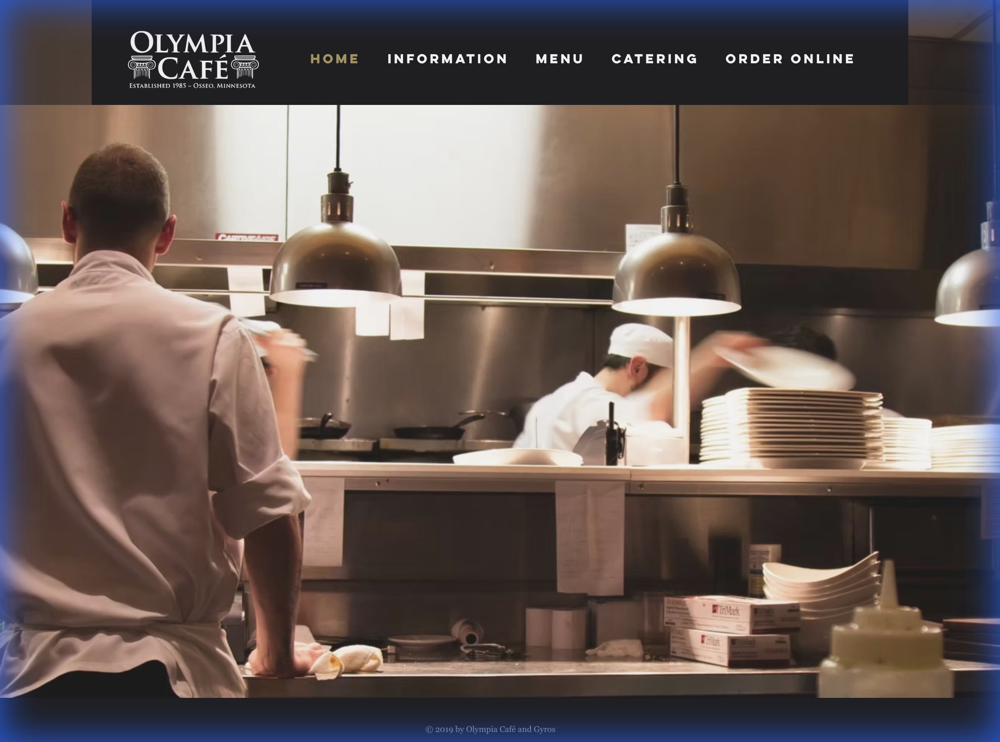
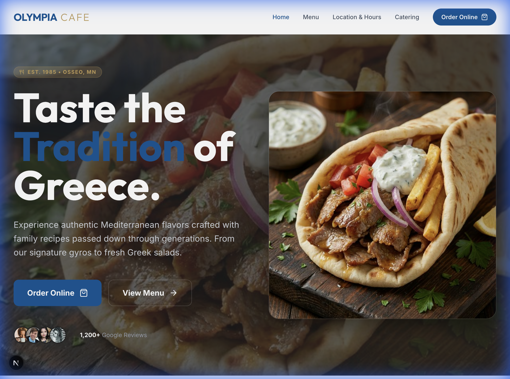
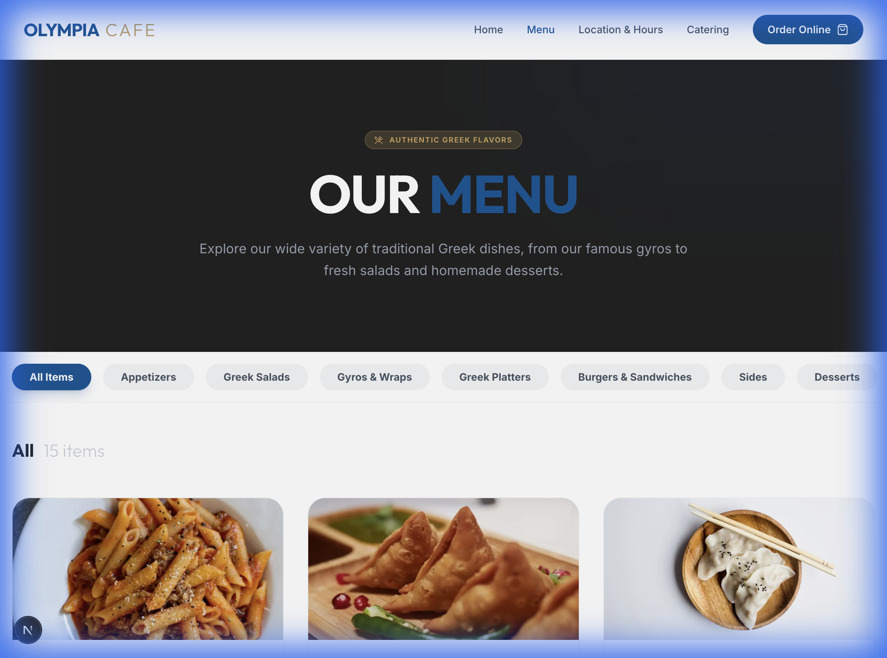
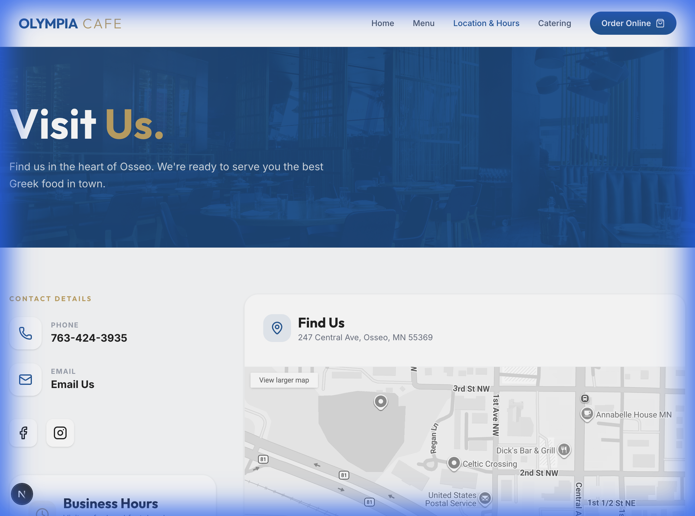
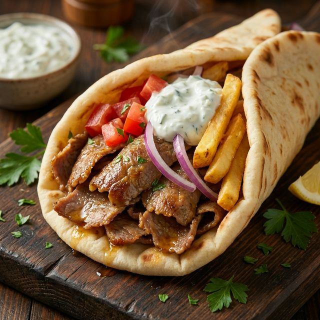
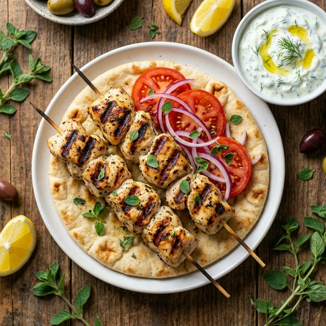
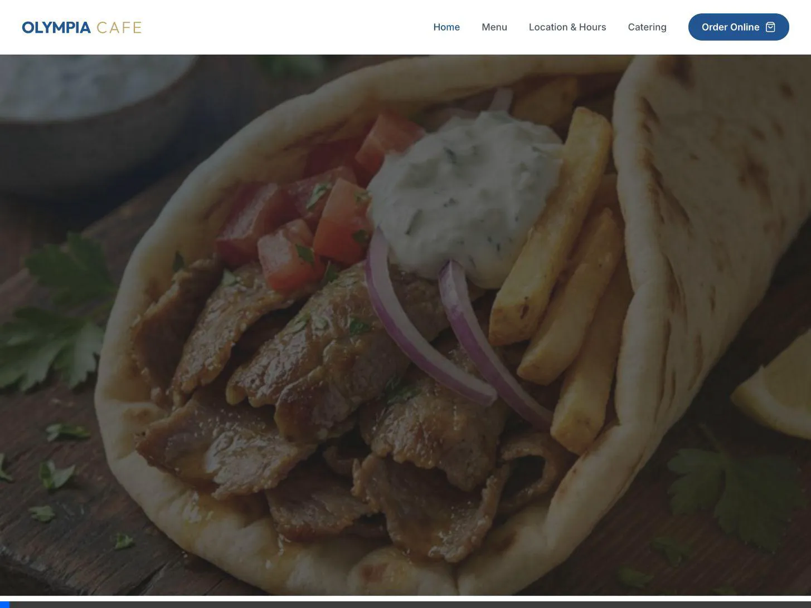

# Walkthrough - Olympia Cafe & Gyros modernization

The modernization project for [Olympia Cafe & Gyros](https://www.olympiacafeandgyros.com/) is complete. We have successfully transitioned from a legacy web presence to a high-performance, componentized Next.js 15 application.

## 🌟 Key Accomplishments

### 1. Modern Greek Aesthetic
I've implemented a "Modern Greek" design system using Tailwind 4, featuring crisp whites, deep Mediterranean blues, and elegant gold accents.
- **Hero Section:** High-impact banner with vibrant food imagery and smooth animations.
- **Typography:** Using "Outfit" for displays and "Inter" for body text for a premium feel.

### 2. Componentized Architecture
As requested, all pages are built using atomic components for maximum maintainability:
- [Navbar.tsx](../src/components/layout/Navbar.tsx): Sticky navigation with a mobile-optimized drawer.
- [CategoryNav.tsx](../src/components/menu/CategoryNav.tsx): Filterable menu navigation.
- [MenuGrid.tsx](../src/components/menu/MenuGrid.tsx): Animated food cards with 'Popular' badges and ToastTab integration.
- [HoursTable.tsx](../src/components/info/HoursTable.tsx): Clean, table-based display of business hours.

### 3. End-to-End Functionality
Each page from the original site has been fully recreated with modernized features:
- **Home:** Hero, About Us highlights, and Featured Products.
- **Menu:** Full categorized menu with filtering logic.
- **Info:** Interactive Google Map, contact details, and business hours.
- **Catering:** Specialized catering services with clear CTAs.

### 4. Comprehensive Documentation
We've added deep documentation requested for local development and cloud deployment:
- [README.md](../README.md): Quick-start guide and tech stack overview.
- [USER_JOURNEY.md](USER_JOURNEY.md): Narrative of the customer experience.
- [GCP_DEPLOYMENT.md](GCP_DEPLOYMENT.md): Step-by-step for Google Cloud Run/App Engine.

## 🖼 Before & After Comparison

I've captured snapshots of the original (legacy) site to demonstrate the impact of the modernization.

### Home Page
| Legacy (Before) | Modern (After) |
| :---: | :---: |
|  |  |

### Menu Page
| Legacy (Before) | Modern (After) |
| :---: | :---: |
|  |  |

### Info & Location
| Legacy (Before) | Modern (After) |
| :---: | :---: |
|  |  |

### Modern High-Quality Assets
I've replaced the missing and low-quality placeholder images with professional food photography assets generated specifically for the Olympia Cafe menu.

| Classic Gyro | Chicken Souvlaki & Spanakopita |
| :---: | :---: |
|  |  |

### Containerization & GCP Ready
The application is now fully containerized and optimized for Google Cloud Platform.
- **GitHub Repository:** [https://github.com/Nithinnjongini/olympia-cafe-modern](https://github.com/Nithinnjongini/olympia-cafe-modern)
- **Dockerfile:** A multi-stage Dockerfile is provided in the root, configured for the Next.js **standalone** build.
- **Minimal Image Size:** The output uses Next.js 15 output file tracing to keep the container image as small as possible.
- **Cloud Run Optimized:** The container listens on port 3000 and is ready to be pushed to Google Artifact Registry and deployed to Cloud Run.

### Local Container Service (Podman)
For local containerized testing without Docker, use Podman:
1. **Build the image:** `podman build -t olympia-cafe-modern .`
2. **Run the container:** `podman run -d --name olympia-container-final -p 3002:3000 olympia-cafe-modern`

**Verification Proof:**

## 🛠 Verification Results

### Development Server
The app is now configured to run on **port 3001** to avoid local conflicts. You can access it at [http://localhost:3001](http://localhost:3001).

### Verification Recording
The video below shows the final end-to-end navigation and responsiveness testing, including the fixed high-quality assets.

## 🚀 How to Review
1.  **Run Locally:** Execute `npm install` and `npm run dev`.
2.  **Verify Pages:** Visit `/`, `/menu`, `/info`, and `/catering`.
3.  **Check Docs:** Read through the files in the `DOCS/` directory.

> [!NOTE]
> All "Order" buttons are correctly linked to the restaurant's existing **ToastTab** platform to ensure business continuity.
